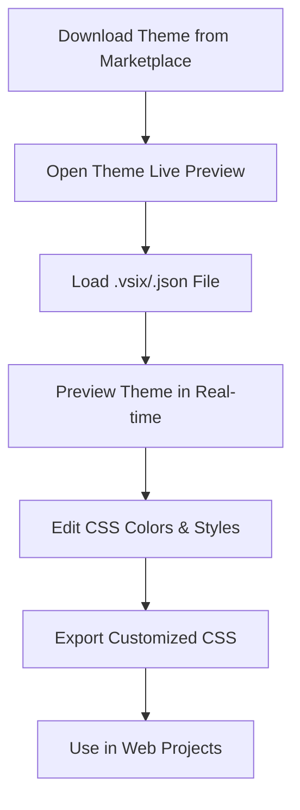

# 🎨 Theme Live Preview Extension

A powerful VS Code extension that provides **live preview** and **real-time editing** of VS Code themes with advanced CSS conversion capabilities. Transform any VS Code theme into customizable CSS for web projects or theme development.

[](https://code.visualstudio.com/)
[](package.json)

## ✨ Features

- 🎨 **Live Theme Preview**: Real-time preview of VS Code themes with instant feedback
- 📝 **CSS Editor**: Edit theme CSS with live updates and syntax highlighting
- 🔄 **Smart Theme Loading**: Load themes from `.json` and `.vsix` files seamlessly
- 🎯 **Color Palette Extraction**: Visual color palette with hex codes and swatches
- 🌈 **Advanced Color Picker**: Interactive color picker with VS Code integration
- 📤 **CSS Export**: Export customized themes as clean, formatted CSS files
- � **JSON Theme Export**: Export themes as VS Code JSON theme files
- 📦 **VSIX Package Export**: Create installable VS Code extension packages
- �🔧 **Advanced CSS Tools**: Format, minify, and optimize CSS output
- 🎯 **Theme Navigation**: Navigate directly to theme items in VS Code settings
- 🔗 **VS Code Integration**: Apply colors directly to your current VS Code theme
- 🚀 **Smart Startup Options**: Choose your workflow - load .vsix, enter CSS, or create new themes
- 📚 **Theme Templates**: Start with pre-built templates for dark, light, and high-contrast themes
- ⚡ **Performance Optimized**: Fast loading and responsive UI
- 🌈 **Multi-format Support**: Works with JSON themes and VSIX packages

## 🚀 Quick Start

### Installation

**Option 1: From VSIX Package (Recommended)**
```bash
# Package the extension
vsce package

# Install the generated VSIX file
code --install-extension theme-live-preview-0.0.1.vsix
```

**Option 2: Development Installation**
```bash
# Clone and install dependencies
npm install

# Compile TypeScript
npm run compile

# Package and install
vsce package
code --install-extension theme-live-preview-0.0.1.vsix
```

**Option 3: Development Mode**
1. Open the extension folder in VS Code
2. Press `F5` to launch Extension Development Host
3. Test the extension in the new window

## 📖 Usage Guide

### Opening the Live Preview

1. Open Command Palette (`Ctrl+Shift+P` / `Cmd+Shift+P`)
2. Search and run **"Open Theme Live Preview"**
3. Choose from the startup options that appear:
   - **📦 Load .vsix Theme File**: Browse and load existing themes
   - **📝 Enter CSS Directly**: Paste or type CSS code directly
   - **🎨 Create New Theme**: Start with a template
   - **🔧 Open Empty Preview**: Start with an empty workspace

### 🚀 Startup Options

When you first open the Theme Live Preview, you'll see a beautiful startup screen with four options:

#### 📦 Load .vsix Theme File
- Browse and select `.vsix` or `.json` theme files
- Perfect for customizing existing marketplace themes
- Automatically extracts and converts themes to CSS

#### 📝 Enter CSS Directly  
- Paste existing CSS code or write from scratch
- Includes a starter template with common VS Code variables
- Ideal for developers who prefer working directly with CSS

#### 🎨 Create New Theme
Choose from professional templates:
- **🌙 Dark Theme Template**: Modern dark theme with GitHub-inspired colors
- **☀️ Light Theme Template**: Clean light theme with professional styling  
- **🎨 High Contrast Template**: Accessibility-focused high contrast theme
- **🌈 Custom Blank Template**: Minimal structure for complete customization

#### 🔧 Open Empty Preview
- Start with a blank workspace
- Load themes later using the toolbar buttons
- Perfect for exploring the interface first

### Loading a Theme

#### Method 1: Command Palette

1. Run **"Load Theme File"** from Command Palette
2. Select a `.json` or `.vsix` theme file from the file picker

#### Method 2: Context Menu

1. Right-click on a `.json` or `.vsix` file in Explorer
2. Select **"Load Theme File"** from the context menu

#### Method 3: From Preview Panel

1. Click **"Load Sample Theme"** for a quick demo
2. Or use the theme loading commands from the panel

### 🎛️ Live Editing & Customization

- **Real-time CSS Editor**: The left panel shows extracted theme CSS
- **Instant Preview**: Edit CSS and see changes immediately in the preview
- **Syntax Highlighting**: Full VS Code syntax highlighting in preview
- **Color Swatches**: Visual representation of all theme colors with interactive controls
- **CSS Tools**: Use Format/Minify buttons to clean up your CSS
- **Undo/Redo**: Full editing history with keyboard shortcuts

### 🌈 Advanced Color Picker Features

- **Interactive Color Picker**: Click the 🎨 button next to any color in the palette
- **VS Code Integration**: Pick colors using VS Code's native color input
- **Live Color Updates**: See color changes instantly in the preview
- **Apply to VS Code**: Use the "Apply" button to apply colors directly to your current VS Code theme
- **Color Validation**: Automatic validation for hex, rgb, rgba, hsl, and hsla color formats

### 🎯 Theme Navigation & Integration

- **Navigate to Theme Items**: Click on any color or theme item to navigate to it in VS Code
- **VS Code Settings Integration**: Automatically opens relevant settings when navigating
- **Theme Item Quick Access**: Use the navigation panel to jump to specific theme elements
- **Settings JSON Integration**: Direct links to VS Code's `workbench.colorCustomizations`
- **Real-time Theme Application**: Apply colors from preview directly to your VS Code interface

### 📤 Exporting Your Work

Choose from multiple export formats to suit your needs:

#### 💾 Export as CSS

1. Load and customize a theme to your liking
2. Click **"📤 Export ▼"** and select **"💾 Export CSS"**
3. Choose the destination folder
4. Get a clean, formatted CSS file ready for web use

#### 📄 Export as JSON Theme

1. Customize your theme in the preview panel
2. Click **"📤 Export ▼"** and select **"📄 Export JSON Theme"**
3. Enter a theme name when prompted
4. Save the `.json` file to your desired location
5. The JSON file can be loaded back into VS Code or shared with others

#### 📦 Export as VSIX Package

1. Create or customize your theme
2. Click **"📤 Export ▼"** and select **"📦 Export VSIX Package"**
3. Enter a theme name for the package
4. Choose where to save the `.vsix` file
5. Install the theme directly into VS Code or share it on the marketplace

**Benefits of VSIX Export:**

- Creates a complete VS Code extension package
- Can be installed via `code --install-extension theme.vsix`
- Includes proper theme metadata and manifest
- Ready for distribution or marketplace publishing

## 🎯 Supported File Formats

| Format | Description | Use Case |
|--------|-------------|----------|
| **`.json`** | Direct VS Code theme files | Custom themes, downloaded themes |
| **`.vsix`** | VS Code extension packages | Marketplace themes, bundled themes |

## 💡 Example Workflow



### Updated Example Workflow

1. **Download** a theme from VS Code Marketplace (`.vsix` file)
2. **Open** the Theme Live Preview panel (`Ctrl+Shift+P` → "Open Theme Live Preview")
3. **Load** the `.vsix` file using the context menu or command
4. **See** the theme instantly converted to CSS with live preview
5. **Pick Colors** using the 🎨 button next to any color in the palette
6. **Navigate** to theme items by clicking on colors or using the navigation panel
7. **Apply** colors directly to VS Code using the "Apply" button
8. **Edit** colors, fonts, and styles in real-time with instant feedback
9. **Export** the customized CSS for your web projects

### New Color Picker Workflow

1. **Load** any theme in the preview panel
2. **Click** the 🎨 button next to any color in the color palette
3. **Choose** a new color using VS Code's color picker
4. **See** the change instantly applied to the preview
5. **Apply** the color to your current VS Code theme with one click
6. **Navigate** to VS Code settings to see the applied customizations

## ⚙️ Available Commands

| Command | ID | Description |
|---------|----|-----------  |
| **Open Theme Live Preview** | `themeLivePreview.openPreview` | Opens the main preview panel |
| **Load Theme File** | `themeLivePreview.loadTheme` | Load a theme from `.json` or `.vsix` file |
| **Export CSS** | `themeLivePreview.exportCSS` | Export current theme as CSS file |
| **Open Color Picker** | `themeLivePreview.openColorPicker` | Open advanced color picker for theme editing |
| **Navigate to Theme Item** | `themeLivePreview.navigateToItem` | Navigate to specific theme items in VS Code |
| **Enter CSS Directly** | `themeLivePreview.enterCSS` | **NEW**: Open CSS input dialog to paste/type CSS |
| **Create New Theme** | `themeLivePreview.createNewTheme` | **NEW**: Create theme from templates |
| **Show Startup Options** | `themeLivePreview.showStartupOptions` | **NEW**: Display startup options dialog |

### Keyboard Shortcuts

- `Ctrl+Shift+P` → Type "Theme Live Preview" for quick access
- `F1` → Alternative to open Command Palette
- Standard VS Code shortcuts work in the CSS editor

## 🛠️ Development & Contributing

### Prerequisites

- **VS Code** version 1.60.0 or higher
- **Node.js** 14.x or higher
- **npm** or **yarn** package manager

### Development Setup

```bash
# Clone the repository
git clone <repository-url>
cd theme-live-preview-extension

# Install dependencies
npm install

# Compile TypeScript
npm run compile

# Watch for changes during development
npm run watch

# Package the extension
vsce package
```bash

### Project Structure

```text
theme-live-preview-extension/
├── src/
│   ├── extension.ts          # Main extension entry point
│   ├── previewPanel.ts       # Preview panel logic
│   └── themeExtractor.ts     # Theme extraction utilities
├── package.json              # Extension manifest
├── tsconfig.json            # TypeScript configuration
└── README.md               # This file
```

### Building and Testing

```bash
# Compile TypeScript
npm run compile

# Run tests (if available)
npm test

# Package for distribution
vsce package

# Install locally for testing
code --install-extension theme-live-preview-0.0.1.vsix
```

## 📋 System Requirements

- **VS Code**: 1.60.0 or higher
- **Node.js**: Required for extension development
- **Operating System**: Windows, macOS, or Linux
- **Memory**: Minimum 4GB RAM recommended
- **Storage**: ~50KB for extension files

## 🔧 Troubleshooting

### Common Issues

**Extension not loading:**

- Ensure VS Code version is 1.60.0+
- Reload VS Code window (`Ctrl+Shift+P` → "Reload Window")
- Check if extension is enabled in Extensions panel

**Theme not loading:**

- Verify file format (`.json` or `.vsix`)
- Check file permissions
- Try loading a different theme file

**CSS export issues:**

- Ensure you have write permissions to target folder
- Check available disk space
- Try exporting to a different location

### Getting Help

1. Check this README for common solutions
2. Open an issue on the GitHub repository
3. Include VS Code version and error messages

## 📝 Release Notes

### Version 0.0.1 (Current)

**🎉 Current Release Features:**

- ✅ Basic theme loading and CSS conversion
- ✅ Live preview with syntax highlighting  
- ✅ CSS export functionality
- ✅ Support for JSON and VSIX theme files
- ✅ Real-time CSS editing capabilities
- ✅ Color palette extraction with interactive controls
- ✅ CSS formatting and minification tools
- ✅ **NEW**: Advanced color picker with VS Code integration
- ✅ **NEW**: Navigation to theme items in VS Code settings
- ✅ **NEW**: Direct color application to current VS Code theme

**🔮 Planned Features:**

- Theme comparison mode
- Custom color picker integration with advanced color theory tools
- Batch theme processing and conversion
- Advanced CSS optimization and compression
- Theme marketplace integration and sharing
- Export to multiple formats (SCSS, LESS, Stylus)
- Theme accessibility analysis and recommendations

## 📄 License

This project is licensed under the MIT License.

## 🤝 Contributing

Contributions are welcome! Please feel free to submit a Pull Request. For major changes, please open an issue first to discuss what you would like to change.

## 🌟 Support

If you find this extension helpful, please consider:

- ⭐ Starring the repository
- 🐛 Reporting bugs and issues
- 💡 Suggesting new features
- 📢 Sharing with other developers

---

Made with ❤️ for the VS Code community
